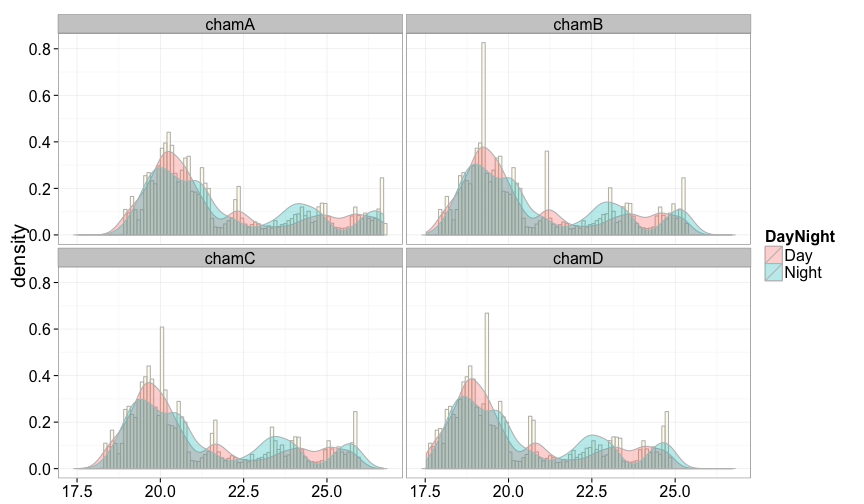
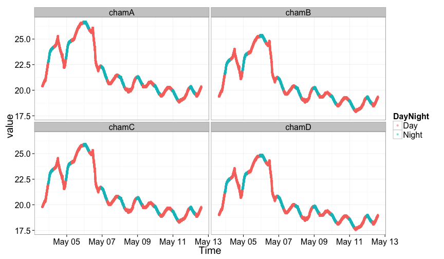
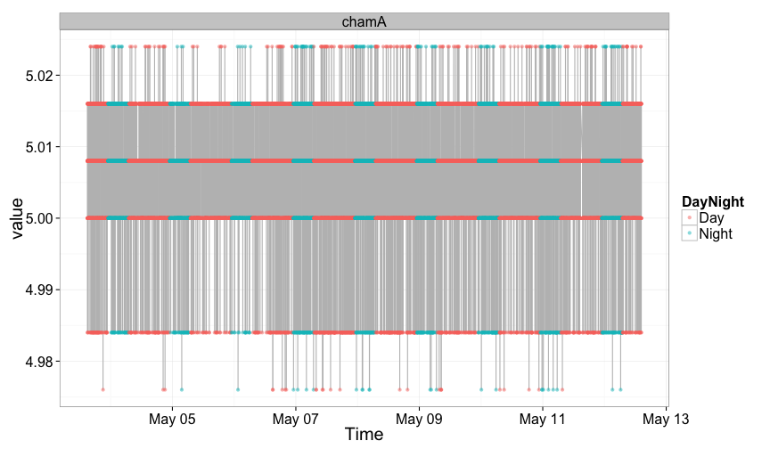

making graphs (Temp Hum, and Volt) from Graphtec Logger data
========================================================

```r
opts_chunk$set(eval = TRUE,
               error = FALSE,
               prompt = TRUE,
               message = FALSE,
               fig.hight = 20,
               fig.width = 12,
               warning = FALSE)

library(tidyr)
library(data.table)
```


Information
-----------
* calculated at 2015-06-06 14:30:45  
* File name: ../RawData/GL_logs/B/150503//150503-145616_UG.CSV, ../RawData/GL_logs/B/150511//150511-152501_UG.CSV  
* Logger ID:GLid:B  
* chamber ID:  cham chamA, chamB, chamC, chamD, chamA  
* for Cucumber in 420 with FL, FL, FL, FL, FL.  
*  ,  ,  ,  ,    


```r
> DNdet <- function(Hour, ONtime, OFFtime){
+   Hour <- as.numeric(Hour)
+     ifelse(test = (Hour >= ONtime && Hour < OFFtime) , yes = "Day", no = "Night")
+ }
> 
> data1 <-
+   data %>%
+   separate(col = Time, into = c("Day", "time"), sep = " ", remove = F) %>%  
+   separate(col = time, into = c("Hour", "Min", "Sec"), sep = ":") %>%
+   select(-Day, -Min, -Sec)
>   
> 
> data2 <-
+   lapply(1:ch.num, function(x){
+     temp <-
+       Memo.dat2 %>%
+       filter(Channel == ch.names[x])
+     data1 %>%
+       select(Time, Hour, value = (x + 2)) %>%
+       mutate(LightOn = temp$LightOn, LightOff = temp$LightOff,
+              DayNight = Vectorize(DNdet)(Hour, LightOn, LightOff),
+              value = temp$slope * value + temp$intercept,
+              variable = temp$Names) %>%
+       select(Time, DayNight, value, variable) %>%
+     return
+   }) %>%
+   rbind_all
> 
> daily_summary <-
+   data2 %>%
+   separate(col = Time, into = c("Day", "Time"), sep = " ", remove = T) %>%
+   select(-Time) %>%
+   group_by(Day, DayNight, variable) %>%
+   summarise_each(funs(mean2, sd2)) %>%
+   mutate(ave = sprintf("%.1f", mean2),
+          sd = sprintf("%.2f", sd2),
+          ave.sd = paste0(ave, "+-", sd, "SD")) %>%
+   select(Day, DayNight, variable, ave, sd, ave.sd) %>%
+   separate(col = variable, into = c("chamID", "log"), sep = ":", remove = T)
> 
> span_summary <-
+   data2 %>%
+   select(-Time) %>%
+   group_by(DayNight, variable) %>%
+   summarise_each(funs(mean2, sd2)) %>%
+   mutate(ave = sprintf("%.1f", mean2),
+          sd = sprintf("%.2f", sd2),
+          ave.sd = paste0(ave, "+-", sd, "SD")) %>%
+   select(DayNight, variable, ave, sd, ave.sd) %>%
+   separate(col = variable, into = c("chamID", "log"), sep = ":", remove = T)
```


```r
> Graphics <-
+   lapply(1:type.num, function(x){
+     data3 <-
+       data2 %>%
+       mutate(Time = as.POSIXct(strptime(Time, format = "%Y/%m/%d %H:%M:%S"))) %>%
+       separate(col = variable, into = c("chamID", "log"), sep = ":", remove = T) %>%
+       filter(log == types[x])
+   
+     hists <- 
+       data3 %>%
+       ggplot(data = ., aes(x = value, y = ..density.., fill = DayNight)) +
+       theme_bw(20) +
+       geom_histogram(binwidth = 0.1, color = "grey", fill = "cornsilk", alpha = 0.5) +
+       geom_density(color = "grey", alpha = 0.3) +
+       xlab(NULL) +
+       facet_wrap( ~ chamID)
+   
+     timecourse <-
+       data3 %>%
+       ggplot(aes(x = Time, y = value, color = DayNight)) +
+       theme_bw(20) +
+       geom_line(color = "grey") +
+       geom_point(alpha = 0.5) +
+       facet_wrap(~ chamID)
+     
+     list(Histgram = hists, TimeCourse = timecourse) %>%
+       return
+     })
> 
> names(Graphics) <- types
```


```r
> # file.info
> file.info(DataFiles) %>% kable
```


|                                                  |    size|isdir | mode|mtime               |ctime               |atime               | uid| gid|uname |grname |
|:-------------------------------------------------|-------:|:-----|----:|:-------------------|:-------------------|:-------------------|---:|---:|:-----|:------|
|../RawData/GL_logs/B/150503//150503-145616_UG.CSV | 2946316|FALSE |  644|2015-06-03 20:51:19 |2015-06-03 21:04:39 |2015-06-06 14:30:45 | 501|  20|keach |staff  |
|../RawData/GL_logs/B/150511//150511-152501_UG.CSV |  353292|FALSE |  644|2015-06-03 20:51:19 |2015-06-03 21:04:39 |2015-06-06 14:30:45 | 501|  20|keach |staff  |

```r
> file.info(Memo.file) %>% kable
```


|             |  size|isdir | mode|mtime               |ctime               |atime               | uid| gid|uname |grname |
|:------------|-----:|:-----|----:|:-------------------|:-------------------|:-------------------|---:|---:|:-----|:------|
|example.xlsx | 32014|FALSE |  644|2015-06-03 20:51:19 |2015-06-03 21:16:12 |2015-06-06 14:30:45 | 501|  20|keach |staff  |

```r
> daily_summary %>% kable
```


|Day        |DayNight |chamID |log  |ave  |sd   |ave.sd       |
|:----------|:--------|:------|:----|:----|:----|:------------|
|2015/05/03 |Day      |chamA  |hum  |5.0  |0.01 |5.0+-0.01SD  |
|2015/05/03 |Day      |chamA  |temp |21.3 |0.70 |21.3+-0.70SD |
|2015/05/03 |Day      |chamB  |temp |20.2 |0.66 |20.2+-0.66SD |
|2015/05/03 |Day      |chamC  |temp |20.7 |0.67 |20.7+-0.67SD |
|2015/05/03 |Day      |chamD  |temp |19.8 |0.65 |19.8+-0.65SD |
|2015/05/03 |Night    |chamA  |hum  |5.0  |0.01 |5.0+-0.01SD  |
|2015/05/03 |Night    |chamA  |temp |22.9 |0.12 |22.9+-0.12SD |
|2015/05/03 |Night    |chamB  |temp |21.8 |0.12 |21.8+-0.12SD |
|2015/05/03 |Night    |chamC  |temp |22.3 |0.12 |22.3+-0.12SD |
|2015/05/03 |Night    |chamD  |temp |21.4 |0.11 |21.4+-0.11SD |
|2015/05/04 |Day      |chamA  |hum  |5.0  |0.01 |5.0+-0.01SD  |
|2015/05/04 |Day      |chamA  |temp |23.8 |0.87 |23.8+-0.87SD |
|2015/05/04 |Day      |chamB  |temp |22.6 |0.82 |22.6+-0.82SD |
|2015/05/04 |Day      |chamC  |temp |23.1 |0.84 |23.1+-0.84SD |
|2015/05/04 |Day      |chamD  |temp |22.2 |0.81 |22.2+-0.81SD |
|2015/05/04 |Night    |chamA  |hum  |5.0  |0.01 |5.0+-0.01SD  |
|2015/05/04 |Night    |chamA  |temp |23.9 |0.32 |23.9+-0.32SD |
|2015/05/04 |Night    |chamB  |temp |22.7 |0.31 |22.7+-0.31SD |
|2015/05/04 |Night    |chamC  |temp |23.2 |0.31 |23.2+-0.31SD |
|2015/05/04 |Night    |chamD  |temp |22.2 |0.30 |22.2+-0.30SD |
|2015/05/05 |Day      |chamA  |hum  |5.0  |0.01 |5.0+-0.01SD  |
|2015/05/05 |Day      |chamA  |temp |25.9 |0.63 |25.9+-0.63SD |
|2015/05/05 |Day      |chamB  |temp |24.6 |0.60 |24.6+-0.60SD |
|2015/05/05 |Day      |chamC  |temp |25.1 |0.61 |25.1+-0.61SD |
|2015/05/05 |Day      |chamD  |temp |24.1 |0.58 |24.1+-0.58SD |
|2015/05/05 |Night    |chamA  |hum  |5.0  |0.01 |5.0+-0.01SD  |
|2015/05/05 |Night    |chamA  |temp |24.8 |0.74 |24.8+-0.74SD |
|2015/05/05 |Night    |chamB  |temp |23.6 |0.70 |23.6+-0.70SD |
|2015/05/05 |Night    |chamC  |temp |24.1 |0.72 |24.1+-0.72SD |
|2015/05/05 |Night    |chamD  |temp |23.1 |0.69 |23.1+-0.69SD |
|2015/05/06 |Day      |chamA  |hum  |5.0  |0.01 |5.0+-0.01SD  |
|2015/05/06 |Day      |chamA  |temp |23.8 |1.61 |23.8+-1.61SD |
|2015/05/06 |Day      |chamB  |temp |22.6 |1.52 |22.6+-1.52SD |
|2015/05/06 |Day      |chamC  |temp |23.1 |1.56 |23.1+-1.56SD |
|2015/05/06 |Day      |chamD  |temp |22.2 |1.49 |22.2+-1.49SD |
|2015/05/06 |Night    |chamA  |hum  |5.0  |0.01 |5.0+-0.01SD  |
|2015/05/06 |Night    |chamA  |temp |25.8 |1.38 |25.8+-1.38SD |
|2015/05/06 |Night    |chamB  |temp |24.6 |1.31 |24.6+-1.31SD |
|2015/05/06 |Night    |chamC  |temp |25.1 |1.34 |25.1+-1.34SD |
|2015/05/06 |Night    |chamD  |temp |24.1 |1.28 |24.1+-1.28SD |
|2015/05/07 |Day      |chamA  |hum  |5.0  |0.01 |5.0+-0.01SD  |
|2015/05/07 |Day      |chamA  |temp |21.0 |0.31 |21.0+-0.31SD |
|2015/05/07 |Day      |chamB  |temp |20.0 |0.29 |20.0+-0.29SD |
|2015/05/07 |Day      |chamC  |temp |20.4 |0.30 |20.4+-0.30SD |
|2015/05/07 |Day      |chamD  |temp |19.6 |0.29 |19.6+-0.29SD |
|2015/05/07 |Night    |chamA  |hum  |5.0  |0.01 |5.0+-0.01SD  |
|2015/05/07 |Night    |chamA  |temp |21.6 |0.39 |21.6+-0.39SD |
|2015/05/07 |Night    |chamB  |temp |20.5 |0.38 |20.5+-0.38SD |
|2015/05/07 |Night    |chamC  |temp |21.0 |0.38 |21.0+-0.38SD |
|2015/05/07 |Night    |chamD  |temp |20.1 |0.37 |20.1+-0.37SD |
|2015/05/08 |Day      |chamA  |hum  |5.0  |0.01 |5.0+-0.01SD  |
|2015/05/08 |Day      |chamA  |temp |20.4 |0.47 |20.4+-0.47SD |
|2015/05/08 |Day      |chamB  |temp |19.3 |0.44 |19.3+-0.44SD |
|2015/05/08 |Day      |chamC  |temp |19.8 |0.45 |19.8+-0.45SD |
|2015/05/08 |Day      |chamD  |temp |19.0 |0.43 |19.0+-0.43SD |
|2015/05/08 |Night    |chamA  |hum  |5.0  |0.01 |5.0+-0.01SD  |
|2015/05/08 |Night    |chamA  |temp |20.8 |0.35 |20.8+-0.35SD |
|2015/05/08 |Night    |chamB  |temp |19.8 |0.34 |19.8+-0.34SD |
|2015/05/08 |Night    |chamC  |temp |20.2 |0.34 |20.2+-0.34SD |
|2015/05/08 |Night    |chamD  |temp |19.4 |0.33 |19.4+-0.33SD |
|2015/05/09 |Day      |chamA  |hum  |5.0  |0.01 |5.0+-0.01SD  |
|2015/05/09 |Day      |chamA  |temp |20.5 |0.18 |20.5+-0.18SD |
|2015/05/09 |Day      |chamB  |temp |19.5 |0.17 |19.5+-0.17SD |
|2015/05/09 |Day      |chamC  |temp |19.9 |0.17 |19.9+-0.17SD |
|2015/05/09 |Day      |chamD  |temp |19.2 |0.16 |19.2+-0.16SD |
|2015/05/09 |Night    |chamA  |hum  |5.0  |0.01 |5.0+-0.01SD  |
|2015/05/09 |Night    |chamA  |temp |20.9 |0.31 |20.9+-0.31SD |
|2015/05/09 |Night    |chamB  |temp |19.8 |0.29 |19.8+-0.29SD |
|2015/05/09 |Night    |chamC  |temp |20.3 |0.30 |20.3+-0.30SD |
|2015/05/09 |Night    |chamD  |temp |19.5 |0.29 |19.5+-0.29SD |
|2015/05/10 |Day      |chamA  |hum  |5.0  |0.01 |5.0+-0.01SD  |
|2015/05/10 |Day      |chamA  |temp |19.9 |0.29 |19.9+-0.29SD |
|2015/05/10 |Day      |chamB  |temp |18.9 |0.27 |18.9+-0.27SD |
|2015/05/10 |Day      |chamC  |temp |19.4 |0.28 |19.4+-0.28SD |
|2015/05/10 |Day      |chamD  |temp |18.6 |0.27 |18.6+-0.27SD |
|2015/05/10 |Night    |chamA  |hum  |5.0  |0.01 |5.0+-0.01SD  |
|2015/05/10 |Night    |chamA  |temp |19.9 |0.25 |19.9+-0.25SD |
|2015/05/10 |Night    |chamB  |temp |19.0 |0.24 |19.0+-0.24SD |
|2015/05/10 |Night    |chamC  |temp |19.4 |0.25 |19.4+-0.25SD |
|2015/05/10 |Night    |chamD  |temp |18.6 |0.24 |18.6+-0.24SD |
|2015/05/11 |Day      |chamA  |hum  |5.0  |0.01 |5.0+-0.01SD  |
|2015/05/11 |Day      |chamA  |temp |19.4 |0.45 |19.4+-0.45SD |
|2015/05/11 |Day      |chamB  |temp |18.4 |0.42 |18.4+-0.42SD |
|2015/05/11 |Day      |chamC  |temp |18.8 |0.43 |18.8+-0.43SD |
|2015/05/11 |Day      |chamD  |temp |18.1 |0.42 |18.1+-0.42SD |
|2015/05/11 |Night    |chamA  |hum  |5.0  |0.01 |5.0+-0.01SD  |
|2015/05/11 |Night    |chamA  |temp |19.5 |0.38 |19.5+-0.38SD |
|2015/05/11 |Night    |chamB  |temp |18.6 |0.36 |18.6+-0.36SD |
|2015/05/11 |Night    |chamC  |temp |19.0 |0.37 |19.0+-0.37SD |
|2015/05/11 |Night    |chamD  |temp |18.2 |0.36 |18.2+-0.36SD |
|2015/05/12 |Day      |chamA  |hum  |5.0  |0.01 |5.0+-0.01SD  |
|2015/05/12 |Day      |chamA  |temp |19.8 |0.27 |19.8+-0.27SD |
|2015/05/12 |Day      |chamB  |temp |18.8 |0.26 |18.8+-0.26SD |
|2015/05/12 |Day      |chamC  |temp |19.2 |0.27 |19.2+-0.27SD |
|2015/05/12 |Day      |chamD  |temp |18.4 |0.26 |18.4+-0.26SD |
|2015/05/12 |Night    |chamA  |hum  |5.0  |0.01 |5.0+-0.01SD  |
|2015/05/12 |Night    |chamA  |temp |19.9 |0.23 |19.9+-0.23SD |
|2015/05/12 |Night    |chamB  |temp |19.0 |0.22 |19.0+-0.22SD |
|2015/05/12 |Night    |chamC  |temp |19.4 |0.22 |19.4+-0.22SD |
|2015/05/12 |Night    |chamD  |temp |18.6 |0.22 |18.6+-0.22SD |

```r
> span_summary %>% kable
```


|DayNight |chamID |log  |ave  |sd   |ave.sd       |
|:--------|:------|:----|:----|:----|:------------|
|Day      |chamA  |hum  |5.0  |0.01 |5.0+-0.01SD  |
|Day      |chamA  |temp |21.7 |2.23 |21.7+-2.23SD |
|Day      |chamB  |temp |20.6 |2.12 |20.6+-2.12SD |
|Day      |chamC  |temp |21.1 |2.16 |21.1+-2.16SD |
|Day      |chamD  |temp |20.2 |2.07 |20.2+-2.07SD |
|Night    |chamA  |hum  |5.0  |0.01 |5.0+-0.01SD  |
|Night    |chamA  |temp |22.0 |2.27 |22.0+-2.27SD |
|Night    |chamB  |temp |20.9 |2.15 |20.9+-2.15SD |
|Night    |chamC  |temp |21.3 |2.20 |21.3+-2.20SD |
|Night    |chamD  |temp |20.5 |2.11 |20.5+-2.11SD |

```r
> Graphics
```

```
## $temp
## $temp$Histgram
```

 

```
## 
## $temp$TimeCourse
```

 

```
## 
## 
## $hum
## $hum$Histgram
```

 

```
## 
## $hum$TimeCourse
```

 

```r
> sessionInfo()
```

```
## R version 3.1.2 (2014-10-31)
## Platform: x86_64-apple-darwin13.4.0 (64-bit)
## 
## locale:
## [1] C
## 
## attached base packages:
## [1] datasets  grid      utils     stats     graphics  grDevices methods  
## [8] base     
## 
## other attached packages:
##  [1] tidyr_0.2.0        data.table_1.9.4   shiny_0.11.1      
##  [4] stringr_0.6.2      agricolae_1.2-1    GGally_0.5.0      
##  [7] magrittr_1.5       gridExtra_0.9.1    foreach_1.4.2     
## [10] gtable_0.1.2       knitr_1.9          xlsx_0.5.7        
## [13] xlsxjars_0.6.1     rJava_0.9-6        reshape2_1.4.1    
## [16] dplyr_0.4.1        plyr_1.8.1         mvtnorm_1.0-2     
## [19] RColorBrewer_1.1-2 gcookbook_1.0      ggplot2_1.0.0     
## [22] MASS_7.3-39       
## 
## loaded via a namespace (and not attached):
##  [1] DBI_0.3.1        LearnBayes_2.15  Matrix_1.1-5     R6_2.0.1        
##  [5] RJSONIO_1.3-0    Rcpp_0.11.4      assertthat_0.1   boot_1.3-15     
##  [9] chron_2.3-45     cluster_2.0.1    coda_0.16-1      codetools_0.2-10
## [13] colorspace_1.2-4 combinat_0.0-8   deldir_0.1-7     digest_0.6.8    
## [17] evaluate_0.5.5   formatR_1.0      htmltools_0.2.6  httpuv_1.3.2    
## [21] iterators_1.0.7  klaR_0.6-12      labeling_0.3     lattice_0.20-29 
## [25] lazyeval_0.1.10  mime_0.2         munsell_0.4.2    nlme_3.1-120    
## [29] parallel_3.1.2   proto_0.3-10     reshape_0.8.5    rmarkdown_0.5.1 
## [33] scales_0.2.4     sp_1.0-17        spdep_0.5-83     splines_3.1.2   
## [37] stringi_0.4-1    tools_3.1.2      xtable_1.7-4     yaml_2.1.13
```


