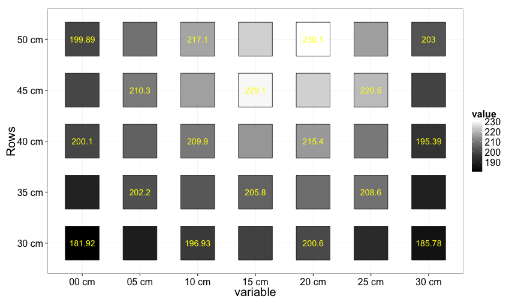

Spatial distribution mapper
========================================================


```r
> Interpolate <-
+   function(x){
+     x_col <- zoo::na.approx(x)
+     x_row <- t(zoo::na.approx(t(x)))
+     x_col.row <- 0.5 * (x_col + x_row)
+     x_col.row_col <- zoo::na.approx(x_col.row)
+     x_col.row_col_row <- t(zoo::na.approx(t(x_col.row_col)))
+     return(as.data.frame(x_col.row_col_row))
+     }
```


```r
> Colnum <-
+   readline("Enter number of light color. ")  
> chamID <-
+   readline("Enter id of the chamber. ") 
> filePath <- 
+   readline("Enter the full path to data folder. ") 
> 
> PFD_summary <-
+   lapply(1:Colnum, function(i){
+   
+   input <-
+     dir(filePath, pattern = "xlsx", full.names = T) %>%
+     read.xlsx(, sheetIndex = i)
+   
+   remarks <-
+     input %>%
+     select(1:2)
+   
+   data <-
+     input %>%
+     select(-(1:4))
+     
+   ColWithValues <-
+     data %>%
+     colwise(length2)(.) %>%
+     unlist != 0
+   
+   ColIDs <-
+     (0:(dim(data)[2]-1) * as.numeric(as.character(remarks[5, 2]))) %>%
+     sprintf(fmt = "%02.0f") %>%
+     paste0(., " cm")
+   
+   RowWithValues <-
+     data %>% t %>% as.data.frame %>%
+     colwise(length2)(.) %>%
+     unlist != 0
+   
+   RowIDs <-
+     ((dim(data)[1]-1):0 * as.numeric(as.character(remarks[5, 2]))) %>%
+     sprintf(fmt = "%02.0f") %>%
+     paste0(., " cm")
+   
+   forGraph <-
+     data[RowWithValues, ColWithValues] %>%
+     Interpolate %>%
+     set_names(ColIDs[ColWithValues]) %>%
+     mutate(Rows = RowIDs[RowWithValues]) %>%
+     melt(id.vars = "Rows")
+   
+   forNums <-
+     data[RowWithValues, ColWithValues] %>%
+     set_names(ColIDs[ColWithValues]) %>%
+     mutate(Rows = RowIDs[RowWithValues]) %>%
+     melt(id.vars = "Rows") %>%
+     set_names(c("Rows", "variable", "numeric"))
+   
+   PFDdata <-
+     merge(forGraph, forNums, by = c("Rows", "variable"))
+   
+   PFDstat <-
+     PFDdata$numeric %>%
+     na.omit %>%
+     adply(.margins = NULL, .fun = c("mean", "sd", "min", "max"))
+   
+   PFDmap <-
+     PFDdata %>%
+     ggplot(aes(x = variable, y = Rows, fill = value)) +
+       geom_point(size = 30, shape = 22, alpha = 1) +
+       scale_fill_gradient(low = "black", high = as.character(remarks[7, 2])) +
+       geom_text(aes(x = variable, y = Rows, label = numeric), color = "yellow", vjust = Inf) +
+       theme_bw(20)
+   
+   Times <- paste0("Measured at ", remarks[1, 2], " ~ ", remarks[2, 2], ".   ")
+   Distance <- paste0("Distance between light and the measured surface: ", remarks[4, 2], ".   ")
+   Measurer <- paste0("Measured with ", remarks[3, 2], ".   ")
+   
+   Lights <- paste0("Light was provided by ", remarks[8, 2], ".   ")
+   Supplier <- paste0("Power supplied by ", remarks[9, 2], " with Amp: ", remarks[10,2], " and Volt: ", remarks[11, 2], ".   ")
+   
+   paste0(Times, Distance, Measurer, Lights, Supplier) %>%
+     list(Info = ., list(data = PFDdata, stats = PFDstat, map = PFDmap))
+   })
> 
> meas_infos <- 
+   lapply(PFD_summary, "[[", 1) %>%
+   unlist %>%
+   as.character
```

Measured at 10:23 ~ 10:35.   Distance between light and the measured surface: 18cm.   Measured with Q41694 (LI-190SA).   Light was provided by Yamano_W-.   Power supplied by PLE60-1.2 with Amp: 0.58A and Volt: 42.4V.   

```r
> lapply(PFD_summary, "[[", 2)
```

```
## [[1]]
## [[1]]$data
##     Rows variable    value numeric
## 1  30 cm    00 cm 181.9200  181.92
## 2  30 cm    05 cm 189.4250      NA
## 3  30 cm    10 cm 196.9300  196.93
## 4  30 cm    15 cm 198.7650      NA
## 5  30 cm    20 cm 200.6000  200.60
## 6  30 cm    25 cm 193.1900      NA
## 7  30 cm    30 cm 185.7800  185.78
## 8  35 cm    00 cm 191.0100      NA
## 9  35 cm    05 cm 202.2000  202.20
## 10 35 cm    10 cm 203.7075      NA
## 11 35 cm    15 cm 205.8000  205.80
## 12 35 cm    20 cm 207.6000      NA
## 13 35 cm    25 cm 208.6000  208.60
## 14 35 cm    30 cm 190.5850      NA
## 15 40 cm    00 cm 200.1000  200.10
## 16 40 cm    05 cm 205.6250      NA
## 17 40 cm    10 cm 209.9000  209.90
## 18 40 cm    15 cm 215.0500      NA
## 19 40 cm    20 cm 215.4000  215.40
## 20 40 cm    25 cm 209.9725      NA
## 21 40 cm    30 cm 195.3900  195.39
## 22 45 cm    00 cm 199.9950      NA
## 23 45 cm    05 cm 210.3000  210.30
## 24 45 cm    10 cm 216.6000      NA
## 25 45 cm    15 cm 229.1000  229.10
## 26 45 cm    20 cm 223.7750      NA
## 27 45 cm    25 cm 220.5000  220.50
## 28 45 cm    30 cm 199.1950      NA
## 29 50 cm    00 cm 199.8900  199.89
## 30 50 cm    05 cm 208.4950      NA
## 31 50 cm    10 cm 217.1000  217.10
## 32 50 cm    15 cm 223.6000      NA
## 33 50 cm    20 cm 230.1000  230.10
## 34 50 cm    25 cm 216.5500      NA
## 35 50 cm    30 cm 203.0000  203.00
## 
## [[1]]$stats
##       mean       sd    min   max
## 1 206.2561 13.02449 181.92 230.1
## 
## [[1]]$map
```

 

```r
> filePath %>% dir(pattern = "xlsx", full.names = T) %>% file.info %>% kable
```


|                                                                        | size|isdir | mode|mtime               |ctime               |atime               | uid| gid|uname |grname |
|:-----------------------------------------------------------------------|----:|:-----|----:|:-------------------|:-------------------|:-------------------|---:|---:|:-----|:------|
|/Users/keach/Dropbox/2015/solanum/1-1/environment//chamK_below_PFD.xlsx | 9864|FALSE |  644|2015-06-04 10:39:57 |2015-06-04 10:44:26 |2015-06-04 11:40:13 | 501|  20|keach |staff  |

```r
> sessionInfo()
```

```
## R version 3.1.2 (2014-10-31)
## Platform: x86_64-apple-darwin13.4.0 (64-bit)
## 
## locale:
## [1] C
## 
## attached base packages:
## [1] datasets  grid      utils     stats     graphics  grDevices methods  
## [8] base     
## 
## other attached packages:
##  [1] data.table_1.9.4   tidyr_0.2.0        stringr_0.6.2     
##  [4] agricolae_1.2-1    GGally_0.5.0       magrittr_1.5      
##  [7] gridExtra_0.9.1    foreach_1.4.2      gtable_0.1.2      
## [10] knitr_1.9          xlsx_0.5.7         xlsxjars_0.6.1    
## [13] rJava_0.9-6        reshape2_1.4.1     dplyr_0.4.1       
## [16] plyr_1.8.1         mvtnorm_1.0-2      RColorBrewer_1.1-2
## [19] gcookbook_1.0      ggplot2_1.0.0      MASS_7.3-39       
## 
## loaded via a namespace (and not attached):
##  [1] DBI_0.3.1        LearnBayes_2.15  Matrix_1.1-5     Rcpp_0.11.4     
##  [5] assertthat_0.1   boot_1.3-15      chron_2.3-45     cluster_2.0.1   
##  [9] coda_0.16-1      codetools_0.2-10 colorspace_1.2-4 combinat_0.0-8  
## [13] deldir_0.1-7     digest_0.6.8     evaluate_0.5.5   formatR_1.0     
## [17] htmltools_0.2.6  iterators_1.0.7  klaR_0.6-12      labeling_0.3    
## [21] lattice_0.20-29  lazyeval_0.1.10  markdown_0.7.4   mime_0.2        
## [25] munsell_0.4.2    nlme_3.1-120     parallel_3.1.2   proto_0.3-10    
## [29] reshape_0.8.5    rmarkdown_0.5.1  scales_0.2.4     sp_1.0-17       
## [33] spdep_0.5-83     splines_3.1.2    stringi_0.4-1    tools_3.1.2     
## [37] zoo_1.7-11
```


